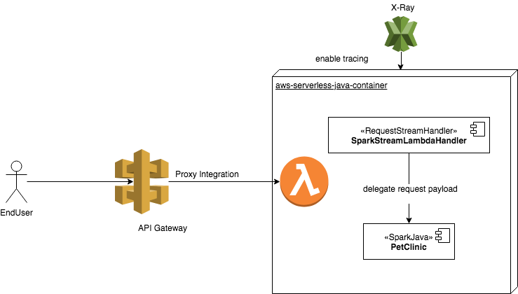

# Integrate with aws-serverless-java-container



By using the aws-serverless-java-container wrapper library, you can easily intercept all the incoming web traffic in to API Gateway.
And the best practice is bind a lambda function with proxy integration mode onto API Gateway. 

All the incoming traffic will first be received by APIG and then delegate to your legacy spring controller.


## Re-thinking what applications you are developing

Java developers are used to define business logics with Dependency injections, because of the variety and complexity rules are always change, need to have a clear design style to keep robustness and responsibility, the famous DI framework - SpringFramework has been the dominator for a while.

However, as complexity growthing, the Spring applications take so long time to start with it. If you are running it at on-premise server, and you never consider about the waste cost on waiting, then you no feelings on it.

How about running your java application in a Serverless Environment, or the so called Function-as-a-Service (FaaS) environment?

### Performance dominate decisions

#### Using AWS X-Ray to point out time consuming period
 


As you see, by using different framework to provide business logic functions, huge cold start time occurs on Springboot.
SparkJava + Guice offers a stable and quick response on it.  


This project is modified from Spring boot Petclinic application only provides a REST API. **There is no UI**.

To show out the better choice on when running java application in the serverlesss environment - AWS Lambda, you should consider about do you still need Spring framework to provide dynamic dependency injection? 

How about compile time dependency injection for you ? [Guice](https://github.com/google/guice) is the one to provide a simple DI framework to deal with most works there.

Dependency Injection are usually to be implemented in 3 patterns:

* Constructor Injection
* Setter Injection
* Field Injection

I recommend to use Constructor injection, because of the way to manage dependencies will keep you have the ability to write unit test codes, or you will have to do whole bunches of mock-injects invoking surround your codes everywhere.

While adopting Gucie to do DI, all you need is add an @Inject annotation on constructor. 

```aidl
public class ClinicServiceImpl implements ClinicService {

    private PetRepository petRepository;
    private VetRepository vetRepository;
    private OwnerRepository ownerRepository;
    private VisitRepository visitRepository;
    private SpecialtyRepository specialtyRepository;
    private PetTypeRepository petTypeRepository;


    @Inject
    public ClinicServiceImpl(
        PetRepository petRepository,
        VetRepository vetRepository,
        OwnerRepository ownerRepository,
        VisitRepository visitRepository,
        SpecialtyRepository specialtyRepository,
        PetTypeRepository petTypeRepository) {
        this.petRepository = petRepository;
        this.vetRepository = vetRepository;
        this.ownerRepository = ownerRepository;
        this.visitRepository = visitRepository;
        this.specialtyRepository = specialtyRepository;
        this.petTypeRepository = petTypeRepository;
    }

```

Then, how can we get the injected implementation classes? how can we define the concrete classes to be injected ? 

Guice take a module concept, let you bind the interface/ contract classes to concrete/implemented classes.

```aidl
public class ClinicModule extends AbstractModule {

    @Override
    protected void configure(){
        /**
         *
         private PetRepository petRepository;
         private VetRepository vetRepository;
         private OwnerRepository ownerRepository;
         private VisitRepository visitRepository;
         private SpecialtyRepository specialtyRepository;
         private PetTypeRepository petTypeRepository;

         */

        bind(OwnerRepository.class).to(JpaOwnerRepositoryImpl.class);

        bind(PetRepository.class).to(JpaPetRepositoryImpl.class);
        bind(VetRepository.class).to(JpaVetRepositoryImpl.class);

        bind(VisitRepository.class).to(JpaVisitRepositoryImpl.class);
        bind(SpecialtyRepository.class).to(JpaSpecialtyRepositoryImpl.class);
        bind(PetTypeRepository.class).to(JpaPetTypeRepositoryImpl.class);

        bind(ClinicService.class).to(ClinicServiceImpl.class);

    }
}
```  

Initialize the binding at application starting : 

```aidl
public static void defineResources() {

        logger.info("starting define route");

        Injector injector = Guice.createInjector(new JpaPersistModule("demo"),new ClinicModule());
        injector.getInstance(DatabaseModule.JPAInitializer.class);

        //通過這裡來配置 rest controller routing

        OwnerRestController ownerRestController = injector.getInstance(OwnerRestController.class);


```
The best way to know what differences between these, take a look on [Dependency Injection Patterns](https://kinbiko.com/java/dependency-injection-patterns/)

For popular Web traffic handler, most of you would like to use SpringMVC to fulfill this technical requirements. 

Same reasons there, by using SpringMVC, you still face the slow dependency injection life cycle.

[SparkJava](http://sparkjava.com/) is the alternative one to replace. The common web based functionalities are well defined, you can leverage Java8 lambda syntax, easily to define a RESTful Resouce method inkove code snippets.

```aidl
import static spark.Spark.*;

public class HelloWorld {
    public static void main(String[] args) {
        get("/hello", (req, res) -> "Hello World");
    }
}
```

An example to map SparkJava between SpringMVC in REST 
```aidl
//@RequestMapping(value = "", method = RequestMethod.GET, produces = MediaType.APPLICATION_JSON_UTF8_VALUE)
        get("/owners", (req, res) -> {

            // Command define the interactive behaviors, pass a function variabile in.
            // while can't get owners, just return 404 not found, instead of let controller to do the detail if else blocks.
            Collection<Owner> owners = ownerRestController.getOwners(() -> res.status(404));
            res.status(200);

            return owners;
        }, new JsonTransformer());
```

### Integration Steps 

1.  Add Maven dependency
    ```
    <dependency>
                <groupId>com.amazonaws.serverless</groupId>
                <artifactId>aws-serverless-java-container-spark</artifactId>
                <version>[0.1,)</version>
    </dependency>
    
    <dependency>
                <groupId>com.sparkjava</groupId>
                <artifactId>spark-core</artifactId>
                <version>2.7.2</version>
    </dependency>
    
    <dependency>
                <groupId>com.google.inject</groupId>
                <artifactId>guice</artifactId>
                <version>4.2.0</version>
    </dependency>
    ```
2.  Add StreamLambdaHandler, to accpet web request from api gateway, and then transparent payload to sparkjava.
    ```
    public class SparkStreamLambdaHandler implements RequestStreamHandler {
        private static SparkLambdaContainerHandler<AwsProxyRequest, AwsProxyResponse> handler;
        static {
            try {
                handler = SparkLambdaContainerHandler.getAwsProxyHandler();
                SparkResourceRoute.defineResources();
                Spark.awaitInitialization();
            } catch (ContainerInitializationException e) {
                // if we fail here. We re-throw the exception to force another cold start
                e.printStackTrace();
                throw new RuntimeException("Could not initialize Spark container", e);
            }
        }
    
        public SparkStreamLambdaHandler() {
            // we enable the timer for debugging. This SHOULD NOT be enabled in production.
            Timer.enable();
        }
    
        @Override
        public void handleRequest(InputStream inputStream, OutputStream outputStream, Context context)
            throws IOException {
            handler.proxyStream(inputStream, outputStream, context);
    
            // just in case it wasn't closed by the mapper
            outputStream.close();
        }
    }

    ```

3.  Run all unit test
    ```
    mvn test
    ```
    > Nothing special, you can just run the following command to check all the changes are well-tested.
    In order words, You still use the Junit + Mockito + SpringMock related tools to maintain the quality

4.  Write a SAM file to do the deployment
    ```
    AWSTemplateFormatVersion: '2010-09-09'
    Transform: AWS::Serverless-2016-10-31
    Description: Example Pet Store API written with spark/guice with the aws-serverless-java-container library
    Resources:
      PetStoreFunction:
        Type: AWS::Serverless::Function
        Properties:
          Handler: solid.humank.serverlesslabs.SparkStreamLambdaHandler::handleRequest
          Runtime: java8
          CodeUri: target/sparkjava-petclinic-1.0.0.jar
          MemorySize: 512
          Policies: AWSLambdaFullAccess
          Timeout: 60
          Events:
            GetResource:
              Type: Api
              Properties:
                Path: /{proxy+}
                Method: any
    
    Outputs:
      SpringBootPetStoreApi:
        Description: URL for application
        Value: !Sub 'https://${ServerlessRestApi}.execute-api.${AWS::Region}.amazonaws.com/Prod/owners'
        Export:
          Name: SparkPetClinicApi
    ```
5.  Deploy it
    ```
    aws cloudformation package --template-file sam.yaml --output-template-file output-sam.yaml --s3-bucket lambda-jar-upload
    
    aws cloudformation deploy --template-file output-sam.yaml --stack-name spark-guice-petclinic --capabilities CAPABILITY_IAM 
    
    aws cloudformation describe-stacks --stack-name spark-guice-petclinic | jq '.Stacks[0].Outputs[0].OutputValue'
    
    ```
    > Then you can hit the provided api gateway url to access the owners list in json payload.

## Database configuration

In its default configuration, Petclinic uses an in-memory database (HSQLDB) which
gets populated at startup with data.